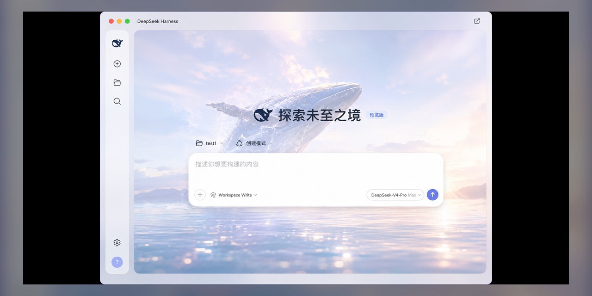
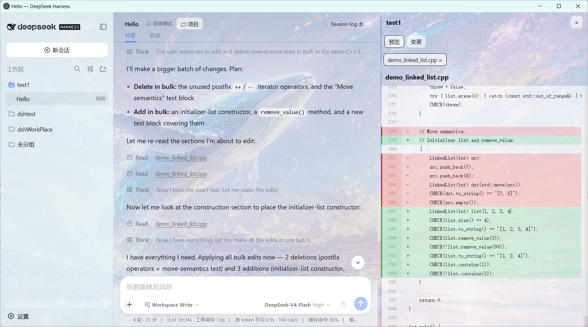
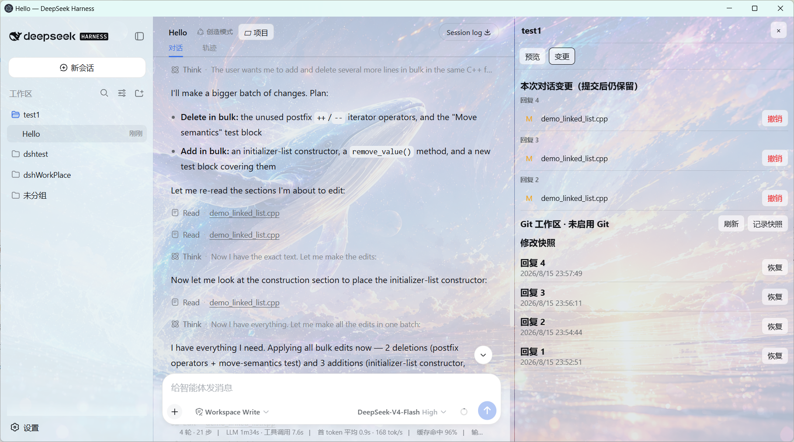
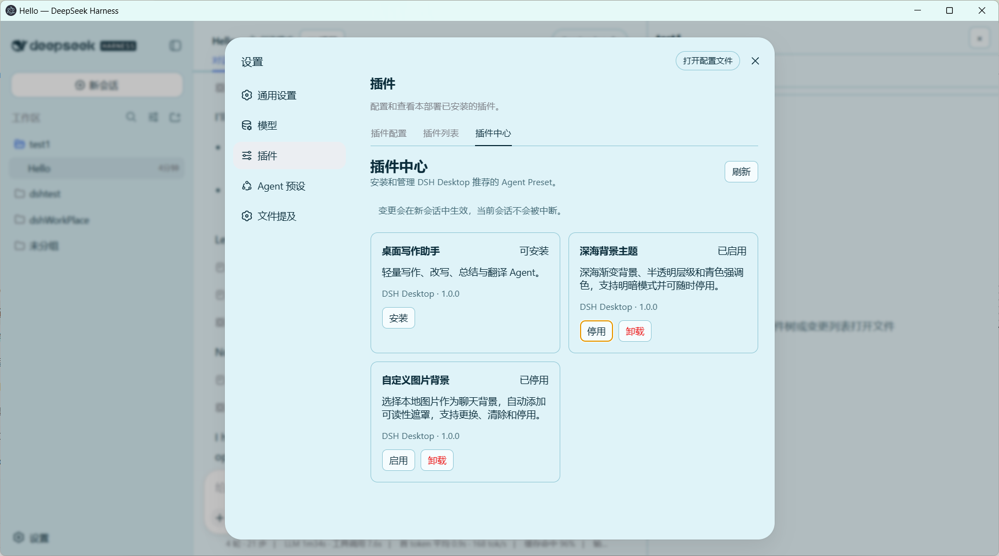
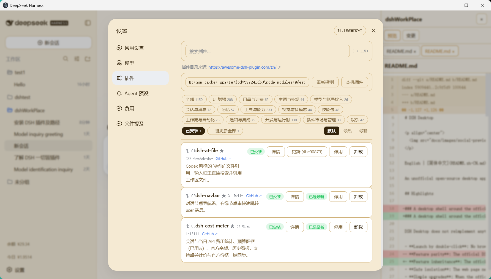
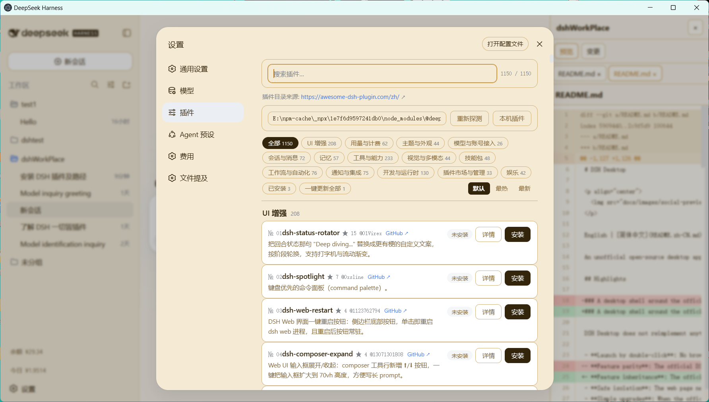

# DSH Desktop

<p align="center">
  
</p>

[English](README.md) | 简体中文

一个基于 DeepSeek Harness 的非官方开源桌面端，提供更简单、直观的桌面使用体验。

## 三大核心优势

### 一、官方 Web 的桌面外壳——功能继承、安全可靠、随版本更新

DSH Desktop 不重复实现功能，而是以官方 DSH Web 为核心封装原生桌面窗口：

- **一键启动**：无需打开浏览器、输入地址或执行命令行，双击桌面图标即可进入与官方 Web 一致的运行环境。
- **功能继承**：以官方 DSH Web 为宿主运行时加载其完整界面与插件体系，会话、工作区数据与插件生态完整保留；内置插件中的 Web 插件市场组件可统一管理桌面端与 Web 端的插件。
- **安全隔离**：渲染进程不直接获得 Node.js、文件系统或任意命令执行权限；Electron 沙箱、contextIsolation、loopback 来源限制与白名单 IPC 共同构成隔离边界。
- **升级简单**：官方 DSH 发布新版本时，桌面端仅需更新版本号并重新打包，已有 `DSH_HOME`、会话、Agent Preset 与持久化插件自动保留。

### 二、基础版保持简洁——仅提供少数实用的桌面增强

基础版不堆砌功能，保留官方 Web 的原有体验，仅增加几项桌面场景中真正需要的增强：

- **项目面板**：与聊天区并排展示，自动列出每轮回复实际修改或生成的文件。支持 Markdown、HTML、代码、Diff、CSV、PDF、图片、文本等多标签预览，可分屏编辑并带冲突检测的原子保存；Git 工作区显示真实状态与单文件撤销，非 Git 目录使用内容快照（不执行 `git init`、不写入项目目录）。每次回复自动记录可恢复快照，恢复前先保存当前状态为恢复点。
- **内置插件（可选安装）**：内置插件以插件目录形式提供，用户按需选择安装，而非预装占用资源。当前提供多套配色主题（深海渐变蓝、极光绿紫、玫瑰落日粉、暖沙琥珀，均支持明暗模式）、自定义图片背景（原生文件选择、透明度调节、随时停用）与轻量写作助手（写作、改写、总结、翻译）。均支持安装、停用与卸载，可随时按需启用或移除。
- **Windows 系统通知（可选）**：Agent 等待审批、任务完成或报错终止时，通过系统通知中心实时提醒，无需一直盯着页面；可在「设置 → 插件 → 内置插件」中随时开启或关闭，默认关闭。

### 三、可扩展、可创造——简洁底座之上的完整插件生态

基础版保持轻量，扩展能力直接可用：

- **内置插件持续上新**：官方精选插件以受信任渠道交付，带完整性校验，可随时安装、停用、卸载，不覆盖用户内容。
- **社区插件市场**：内置固定版本的社区市场组件，启用后即可在设置中浏览 [awesome-dsh-plugin.com](https://awesome-dsh-plugin.com/) 收录的数百个社区插件，进行集中式安装、更新与卸载；应用内置 `pnpm`，无需全局安装。市场安装的插件进入共享 `DSH_HOME`，桌面端与浏览器版均可使用。
- **按需扩展**：需要更多能力时，从内置插件与社区市场中按需选择；不需要时保持基础版的原样简洁。

## 下载

### 两种使用方式

| 方式 | 适合谁 | 特点 |
|---|---|---|
| **一键安装包** | 大多数普通用户 | 双击安装即用，无需任何环境；使用你自己的数据（`DSH_HOME`、会话、插件），但 DSH 由桌面端内置运行时启动 |
| **连接模式** | 已有 Node.js、想要完整使用官方 DSH 的用户 | 不仅使用你自己的数据，DSH Web 本体也由你用系统 Node 启动（npx 拉最新版），桌面端只做壳连接，不依赖内置运行时 |

两种方式共享同一套数据（`DSH_HOME`、会话、插件），可随时切换。开发者也可直接[从源码运行](#从源码运行)，`npm start` 走 auto 模式优先复用系统环境。

### 一键安装包

请从 [GitHub Releases](https://github.com/yxccai/dsh-desktop/releases/tag/v0.5.0) 下载：

- [Windows x64 安装版](https://github.com/yxccai/dsh-desktop/releases/download/v0.5.0/DSH-Desktop-0.5.0-win-x64.exe)
- [SHA-256 校验文件](https://github.com/yxccai/dsh-desktop/releases/download/v0.5.0/SHA256SUMS-0.5.0.txt)

### macOS 测试版

Apple Silicon（M 系列）:

- [macOS arm64 DMG](https://github.com/yxccai/dsh-desktop/releases/download/v0.5.0/DSH-Desktop-0.5.0-mac-arm64.dmg)
- [macOS arm64 ZIP](https://github.com/yxccai/dsh-desktop/releases/download/v0.5.0/DSH-Desktop-0.5.0-mac-arm64.zip)

Intel 版（x64）构建完成后可在 [Releases 页面](https://github.com/yxccai/dsh-desktop/releases/tag/v0.5.0) 找到。

首次启动时，请在 Finder 中按住 Control 点击应用并选择「打开」；若 macOS 仍阻止运行，请前往「系统设置 → 隐私与安全性 → 仍要打开」。正式签名与公证将在后续版本加入。

## 界面截图

### 对话文件与项目预览面板



### 对话快照与单文件回原



### 可管理的插件中心



### 社区插件市场

内置的社区插件市场组件挂载到共享 `DSH_HOME` 后，可统一管理桌面端与 Web 端已安装的插件，并随时浏览、安装社区新增插件：





## 工作方式

DSH Desktop 会自动选择可用环境：

1. 连接已运行的 DSH；
2. 复用全局 `dsh`；
3. 复用系统 `npx/npm`；
4. 使用应用内置的 DSH Runtime。

已有用户通常可以继续使用原来的 `DSH_HOME`、会话、Agent Preset 和持久化插件；新用户无需预先安装 DSH 或 Node.js。

## 项目面板

项目会话会在每次回复下方显示本次对话实际修改或生成的文件；点击文件名后在右侧以多标签打开，标签顶部显示文件名并可用 `×` 关闭。预览支持 Markdown、HTML、代码、Diff、CSV、PDF、图片和文本，以及源码/预览切换、分屏编辑和带外部修改检测的原子保存；面板打开时聊天区会同步缩窄，不会被遮挡。“变更”页提供真实 Git 状态、Diff 和单文件撤销。面板宽度、折叠状态和当前页面均按项目保存。

每次助手回复完成后，Git 项目会通过独立临时索引记录可恢复的 Tree 快照，不会改动用户暂存区；普通非 Git 目录则使用 DSH Desktop 数据目录中的内容 Blob 快照，不会执行 `git init` 或污染项目目录。两种模式都会在恢复前自动保存当前状态作为恢复点。Office 文件目前使用系统应用打开，后续再增加 DOCX/XLSX/PPTX 内置渲染。

## Web 插件市场（可选）

DSH Desktop 内置社区插件市场 [`@sanqi-normal/dsh-webui-market-plugin`](https://github.com/Sanqi-normal/dsh-webui-market-plugin)（MIT，vendored 于 `resources/market-plugin`），可按需挂载到共享的 `DSH_HOME`，让 DSH Web 界面获得「设置 → 插件 → 插件市场」入口：浏览 [awesome-dsh-plugin.com](https://awesome-dsh-plugin.com/) 社区目录，把插件安装/卸载到 web profile。

- **两个管理入口**：桌面插件中心窗口的「Web 插件市场」页，以及 Web 设置桥的「内置插件」页卡片。安装 / 启用 / 停用 / 卸载都是互斥的事务操作，作用于 `$DSH_HOME/cordis.patch.yml` 与 `$DSH_HOME/node_modules/@sanqi-normal/dsh-webui-market-plugin`；`$DSH_HOME/profiles/web` 永不被修改。
- **无需全局安装 pnpm**：应用内置 pnpm 并生成 PATH 垫片（`src/pnpm-runtime.js`），随每个 DSH 进程继承，因此 Windows 上即使从未全局安装 pnpm（npx / global / bundled 启动方式），市场安装也能正常执行；手动在终端启动的 DSH 服务也会自动回退到 `$DSH_HOME/bin` 下的内置 pnpm。若 pnpm 确实不可用，市场会给出清晰的中文提示，而不是一堆乱码。
- **自动处理常见安装问题**：git 依赖的构建脚本自动放行（`dangerously-allow-all-builds`）；迁移过的 profile 自动沿用原 pnpm store（`npm_config_store_dir`）；锁文件缺少 tarball 完整性校验（旧版 pnpm 生成的裸 GitHub URL 条目）时自动改写为 `github:` 语法并重试一次。
- **第三方风险提示**：市场中的插件由社区作者编写，安装后会在 DSH 进程内以宿主权限运行（文件、网络、命令行）。请只安装你信任的来源。桌面应用内置的是固定版本并校验包完整性，拒绝操作外来或已被篡改的内容，但对第三方插件的行为不承担任何责任。
- **需要重启**：变更在 DSH web 服务重启后生效，当前运行的会话不会被中断。
- 来源与复现说明见 `resources/market-plugin/VENDORED.md`：Host 半端是上游副本加上 DSH Desktop 的两处可移植性补丁（内置 pnpm 的 PATH 垫片、人性化的 pnpm 缺失报错），Client 半端是独立重设计的原创 UI（MIT）。

## 插件兼容

遵循官方 DSH/Cordis 接口的 Host 插件、Slot UI、主题和持久化 Preset 通常具有较好的兼容性。依赖固定 DOM、浏览器扩展或开发 HMR 的插件需要单独测试。

## 连接模式（完整使用官方 DSH Web，不只是用数据）

一键安装包虽然会保留你的数据（`DSH_HOME`、会话、插件），但 DSH 进程由桌面端内置的固定版本（rc.6）以 Electron-as-Node 方式启动。连接模式则更进一步：**DSH Web 本体也由你用自己的系统 Node 启动**（`npx` 拉取官方最新版），桌面端只做壳连接——数据、进程、版本都完全由你掌控。

DSH Desktop 默认按 `auto` 顺序选择运行环境（连接已有服务 → 全局 `dsh` → 系统 `npx` → 内置 runtime）。如果你希望 DSH Web 由**自己用系统 Node 启动**，用连接模式：

### 完整步骤

1. **安装 Node.js**（连接模式的前提）：到 [nodejs.org](https://nodejs.org) 下载 LTS 版本并安装。

2. **安装桌面端**（任选其一）：
   - 下载[一键安装包](#一键安装包)并安装；
   - 或[从源码运行](#从源码运行)（开发者）。

3. **用系统 Node 启动 DSH Web**（在终端运行，保持窗口开启）：

```powershell
npx @deepseek-ai/dsh web --host 127.0.0.1 --port 3080
```

4. **把桌面端配置为只连接、不自行启动服务**：

```json
{
  "launchMode": "connect",
  "url": "http://127.0.0.1:3080"
}
```

配置位置：`<userData>\config.json`（Windows 默认 `C:\Users\<用户名>\AppData\Roaming\dsh-desktop-shell\config.json`；若设置了 `DSH_DESKTOP_HOME` 则在对应目录）。

5. **打开桌面端**：它会检测到 3080 已有 DSH 服务并直接连接，不再使用内置 runtime。

这样你的 DSH 跑在**真正的 Node** 里（`process.execPath` 是 `node.exe`），桌面端只提供窗口、项目面板、内置插件与系统通知——**不依赖 Electron-as-Node 内置运行时**，也能获得最及时的上游更新。

> 注意：连接模式下，DSH Web 由你的终端启动并管理，关闭终端即停止服务；桌面端不会自行拉起它。

### 从源码运行

```powershell
git clone https://github.com/yxccai/dsh-desktop.git
cd dsh-desktop
npm ci
npm run check
npm test
npm start
```

`npm start` 默认走 `auto` 模式：优先连接/复用你系统的 `dsh` 或 `npx`，同样不会强制使用内置运行时。

## 平台支持

- **Windows x64**：安装版已发布并验证。
- **macOS Intel / Apple Silicon**：已提供未签名测试版预发布包。首次启动时请在 Finder 中按住 Control 点击应用，选择“打开”；如果 macOS 仍然阻止运行，请前往“系统设置 → 隐私与安全性 → 仍要打开”。正式签名和公证将在后续加入。
- 其他平台将在后续版本中评估。

## 开发

```powershell
npm ci
npm run check
npm test
npm start
```

更多信息：

- [更新记录](CHANGELOG.md)
- [安全说明](SECURITY.md)
- [贡献指南](CONTRIBUTING.md)
- [Runtime 说明](docs/runtime-provisioning.md)

## 许可证

本项目采用 [MIT License](LICENSE)。DeepSeek Harness、Electron 及其他依赖遵循各自许可证。
